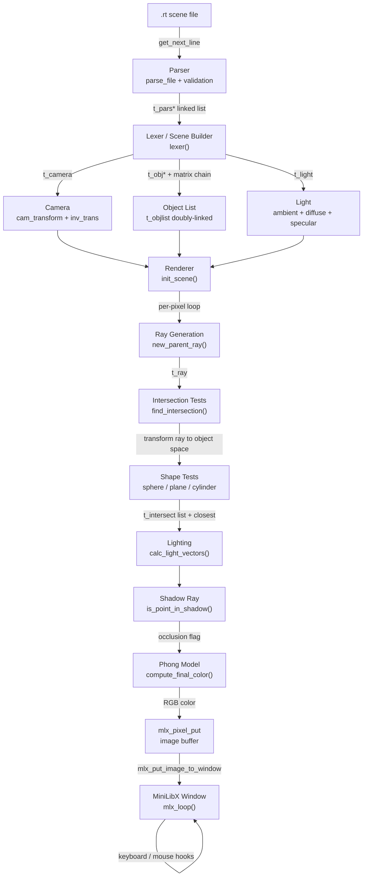

# miniRT

> A software ray tracer written in C from scratch — implementing a full rendering pipeline with matrix-based transforms, Phong lighting, shadow casting, and an interactive MiniLibX window.


---

## Table of Contents

- [Overview](#overview)
- [Engineering Focus](#engineering-focus)
- [Key Features](#key-features)
- [System Architecture](#system-architecture)
- [Data Flow](#data-flow)
- [Core Concepts](#core-concepts)
- [Project Structure](#project-structure)
- [Scene File Format](#scene-file-format)
- [Getting Started](#getting-started)
- [Future Improvements](#future-improvements)
- [Engineering Notes](#engineering-notes)
- [License](#license)

---

## Overview

miniRT is a CPU ray tracer implemented entirely in C without any graphics or math libraries beyond MiniLibX for window output. It renders 3D scenes defined in `.rt` text files into a pixel-by-pixel image displayed in a live window.

The interesting engineering challenge is not just tracing rays — it is doing it correctly under coordinate system constraints. Every object lives in its own **local object space** (a unit sphere, a unit cylinder, an infinite plane), and all intersection math is performed there. Objects are placed, rotated, and scaled in world space via **4×4 transformation matrices** whose inverses are applied to rays before intersection tests run. This means the intersection functions themselves are trivially simple — complexity lives entirely in the matrix pipeline.

---

## Engineering Focus

- **4×4 matrix algebra** — translation, rotation, scaling, and chaining built from scratch; no external math library
- **Ray-object space transforms** — rays are transformed into object-local space rather than transforming objects, keeping intersection math canonical
- **Phong lighting model** — ambient, diffuse, and specular components computed per pixel with configurable coefficients
- **Shadow ray casting** — a secondary ray is fired toward the light source per intersection to determine occlusion
- **Surface normal computation** — per-shape normal derivation including cylinder caps vs body distinction and transpose-matrix correction for scaled normals
- **Scene parsing pipeline** — two-stage tokeniser → builder pipeline from a plain-text `.rt` file with strict validation

---

## Key Features

- Sphere, plane, and cylinder primitives with full transform support
- Phong shading: ambient + diffuse + specular with configurable shininess
- Hard shadow casting via shadow rays with self-intersection guard (`EPSILON` offset)
- Camera with configurable field of view and arbitrary orientation
- Scene defined in a human-readable `.rt` file — no recompilation needed to change scenes
- Interactive window: keyboard hooks for navigation, mouse hooks for object selection
- Cylinder cap and body normals computed separately with correct world-space correction via transpose of inverse transform
- Full matrix inversion via cofactor expansion (Laplace expansion) — no numerical shortcuts

---

## System Architecture

The renderer is structured as a sequential pipeline: parse → build scene graph → render → display. There is no deferred or async rendering — the scene is rasterised pixel by pixel in a single blocking pass before the event loop begins.



**Component responsibilities:**

| Component | Role |
|---|---|
| **Parser** | Reads `.rt` line by line via `get_next_line`; validates identifiers, value counts, numeric format, comma placement; builds a `t_pars` linked list |
| **Lexer / Builder** | Consumes `t_pars` and constructs the live scene: builds the camera inverse transform, allocates `t_obj` nodes with chained transform matrices, configures the light |
| **Matrix pipeline** | Computes `scale → rotate → translate` transform chain per object; inverts each to produce `inv_trans` used at render time |
| **Renderer** | Iterates every pixel `(x, y)` in a nested loop; generates a primary ray; runs intersection tests; computes lighting; writes to the image buffer |
| **Intersection engine** | Transforms the primary ray into each object's local space; solves the geometric equation for that primitive; records all hits in a `t_intersect` linked list; tracks the closest |
| **Lighting** | Computes the hit point, surface normal, eye vector, and reflection vector; fires a shadow ray; applies the Phong model |
| **MiniLibX layer** | Owns the window, image buffer, and event loop; receives the fully rendered image in one `mlx_put_image_to_window` call |

---

## Data Flow

What happens when the renderer processes a single pixel:

1. **Ray generation** — `new_parent_ray` constructs a ray from the camera origin through the pixel center. The pixel's position on the canvas is derived from the FOV and canvas half-size. The ray origin and direction are then transformed into world space by multiplying by the camera's `inv_trans`.

2. **Object-space intersection** — `find_intersection` iterates the object list. For each object, `transform_ray` applies the object's `inv_trans` to produce a child ray in the object's local coordinate system (unit sphere, unit cylinder, or XZ plane). The intersection equations are solved in this simplified space:
   - **Sphere**: quadratic formula on `|ray - center|² = 1`
   - **Plane**: `t = -ray.origin.y / ray.dir.y` (plane is always at Y=0 in local space)
   - **Cylinder body**: quadratic on `x² + z² = 1` with Y bounds clamped to `[min, max]`
   - **Cylinder caps**: flat disc test at `y = min` and `y = max`

3. **Hit recording** — valid intersections (`dist > EPSILON`) are appended to the primary ray's `t_intersect` linked list and the closest pointer is updated in-place.

4. **Surface normal** — computed in object-local space and transformed back to world space using the **transpose of the inverse transform** (the correct transform for normals under non-uniform scaling). Cylinder caps return axis-aligned normals `(0,±1,0)`; the body returns a radial normal `(x, 0, z)`.

5. **Shadow test** — a shadow ray is spawned from the hit point (offset by `2 × EPSILON` along the normal to avoid self-intersection) toward the light source. If any object is closer than the light distance, the point is in shadow and specular/diffuse terms are suppressed.

6. **Phong shading** — `compute_final_color` computes:
   - `ambient = blend(light.color, obj.color) × light.ambient`
   - `diffuse = blend × (light.diffuse × dot(L, N))`
   - `specular = light.color × (pow(dot(R, E), shine) × light.specular)`
   where `L` is the light direction, `N` the surface normal, `R` the reflection vector, and `E` the eye vector.

7. **Pixel write** — the computed RGB color is written directly into the MiniLibX image buffer via `mlx_pixel_put`. After the full pixel loop completes, the buffer is flushed to the window in one `mlx_put_image_to_window` call.

---

## Core Concepts

### Object-Space Ray Transformation

Rather than transforming objects into world space (which would require updating geometry per frame), the implementation inverts the approach: the object's transform matrix is computed once at load time and immediately inverted. At render time, each ray is transformed by `obj->inv_trans` before the intersection test. This means every shape is always a canonical unit primitive — the sphere is always radius 1 at the origin, the cylinder always has radius 1 and axis along Y. The intersection math becomes trivial; all complexity is in the matrix layer.

### 4×4 Matrix Pipeline

Transforms are composed as a chain: `scale → rotate → translate`. Each step produces a 4×4 matrix. `chain_transform` multiplies them right-to-left (applying scale first, then rotation, then translation). The final matrix is inverted via **Laplace cofactor expansion** — `determinant` recurses down to 2×2 base cases, `cofactor` eliminates rows/columns via `sub_matrix`, and the inverse is `cofactor_matrix^T / determinant`. The inverse is precomputed and stored per object — it is never recomputed per ray.

### Normal Transform Correction

When a surface is scaled non-uniformly, transforming its normal by the same matrix as its points produces incorrect results. The correct transform for normals is the **transpose of the inverse** of the model matrix. `calc_sph_normal` and `calc_cyl_normal` explicitly compute `transpose(obj->inv_trans)` and apply it to the object-space normal before normalising.

### Shadow Acne Prevention

Shadow rays originate at the intersection point. Floating-point precision means this point may sit fractionally inside the surface, causing the shadow ray to immediately re-intersect the same object. The fix is `scalar_mult(light->normal, EPSILON * 2, &offset); add(hit_point, offset, &shadow_ray.og)` — the shadow ray origin is pushed slightly outside the surface along the normal before testing.


---

## Project Structure

```
miniRT-42/
├── includes/          # Per-subsystem headers; each defines one struct and its prototypes
│   ├── vector.h       # t_vec (float[4]), all vector operations
│   ├── matrix.h       # t_mtrx (float[4][4]), transform and inversion prototypes
│   ├── shapes.h       # t_obj, t_objlist; intersection function prototypes
│   ├── ray.h          # t_ray, t_intersect; ray transform prototypes
│   ├── camera.h       # t_camera; view matrix and pixel-size computation
│   ├── light.h        # t_light; Phong parameter storage and lighting prototypes
│   ├── parsing.h      # t_elem, t_pars; parser and per-type add functions
│   └── header.h       # Top-level include: pulls all subsystem headers
├── src/
│   ├── main.c         # Entry point: arg validation, parse → build → render → event loop
│   ├── vectors/       # Dot product, cross product, normalize, blend_colors, scalar ops
│   ├── matrix/
│   │   ├── matrix_op.c        # Multiply, transpose, identity, copy
│   │   ├── matrix_inversion.c # sub_matrix, determinant, cofactor, invert_matrix
│   │   ├── transform.c        # scale(), rotate(), translate(), chain_transform()
│   │   └── rotations.c        # Per-axis rotation matrices; set_up_rotations()
│   ├── render/
│   │   ├── scene.c     # init_scene(): pixel loop, new_parent_ray, get_pixel_color
│   │   ├── ray.c       # add_hit_to_ray, transform_ray, update_closest_hit
│   │   ├── shape.c     # intersects_sphere/plane/cylinder_body/cylinder_caps
│   │   ├── light.c     # calc_light_vectors, calc_light_reflection, compute_final_color
│   │   └── light_utils.c # calc_sph/cyl/plane_normal, is_point_in_shadow
│   ├── parsing/        # parse_file, per-type validation, t_pars list construction
│   ├── lexer/          # add_cam/obj/light_lexer; scene graph construction from t_pars
│   └── utils/          # MiniLibX setup, hook handlers, object list utilities
├── maps/              # Sample .rt scene files (spheres, cylinders, planes, lighting tests)
└── libs/
    ├── libft/         # Custom libc subset
    ├── get_next_line/ # Line-by-line file reading
    └── libmlx_Linux.a # MiniLibX precompiled for Linux
```

---

## Scene File Format

A `.rt` file defines the scene declaratively. Each line specifies one element:

```
# Lighting
A   0.2     255,255,255          # ambient: ratio  R,G,B
L   0,5,-10  0.8  255,255,255   # point light: pos  ratio  R,G,B

# Camera
C   0,0,-5  0,0,1  70           # pos  orientation  FOV(degrees)

# Objects
sp  0,0,0    2     255,0,0      # center  diameter  R,G,B
pl  0,-1,0   0,1,0  100,100,100 # center  normal    R,G,B
cy  0,0,3    0,1,0  1  4  0,255,0  # center  axis  diameter  height  R,G,B
```

Rules enforced by the parser:
- Only one camera and one ambient light; duplicates are silently ignored
- Comments begin with `#`
- Identifiers are case-sensitive (`C` vs `cy`)
- All numeric values are validated for sign, decimal point, and comma placement before any `atof` call

---

## Getting Started

### Requirements

- Linux (MiniLibX Linux build is included)
- GCC or Clang
- GNU Make
- X11 development headers: `sudo apt install libx11-dev libxext-dev`

### Build & Run

```sh
git clone https://github.com/artclave/miniRT-42.git
cd miniRT-42
make
./miniRT maps/basic_shape/sphere.rt
```

```sh
make clean    # remove object files
make fclean   # remove object files and binary
make re       # fclean + rebuild
```

### Controls

| Input | Action |
|---|---|
| `ESC` | Close window and exit |
| `X` button | Close window and exit |
| Mouse click | Select object |

---

## Future Improvements

- **Multi-threading** — the pixel loop is embarrassingly parallel; dividing the image into horizontal bands and rendering each on a separate thread would give a near-linear speedup proportional to core count
- **Anti-aliasing** — supersampling (multiple rays per pixel with sub-pixel offsets averaged) would eliminate jagged edges with minimal algorithmic change
- **Reflections** — recursive ray spawning at specular surfaces; requires a maximum recursion depth and a reflection coefficient per object
- **Refraction / transparency** — Snell's law ray bending at material boundaries with configurable refractive index
- **BVH acceleration** — a bounding volume hierarchy would replace the linear object-list traversal with O(log n) intersection culling for scenes with many objects
- **Texture mapping** — UV coordinate derivation per shape mapped to a loaded image for surface textures

---

## Engineering Notes

**Inverse transform is the core architectural decision.**
Everything else follows from it. Once you commit to transforming rays into object space rather than transforming objects into world space, the intersection functions collapse to their simplest canonical forms, normal computation has a clear mathematical derivation (transpose of inverse), and adding new primitive types requires only implementing their unit-space intersection — the transform layer is shared and free.

**Matrix inversion via cofactor expansion is exact but O(n!) in the general case.**
For 4×4 matrices only it is a fixed-cost operation — 4 cofactors each requiring a 3×3 determinant each requiring three 2×2 determinants. The implementation is correct and the cost is paid once at scene load time, never per-ray. A production renderer would use the analytic closed-form inverse for affine transforms, but the recursive cofactor approach makes the mathematics explicit and verifiable.

**The shadow acne problem is a concrete lesson in floating-point geometry.**
The `EPSILON * 2` normal offset for shadow ray origins is not a hack — it is the standard fix for a fundamental precision issue that every ray tracer encounters. The specific value of the offset matters: too small and self-intersection artefacts persist; too large and objects incorrectly shadow themselves at grazing angles. Getting this right requires understanding where floating-point error accumulates in the intersection equations.

**Parsing correctness before rendering correctness.**
The two-stage parse → lex pipeline enforces this separation cleanly. The parser's job is exclusively validation and tokenisation — it never touches the scene graph. The lexer's job is exclusively construction — it never touches the file. This means parsing errors are caught and reported with meaningful messages before a single matrix is allocated, and the renderer can assume its input is structurally valid.

---

## License

This project is licensed under the MIT License.

---

[↑ Back to top](#minirt)
